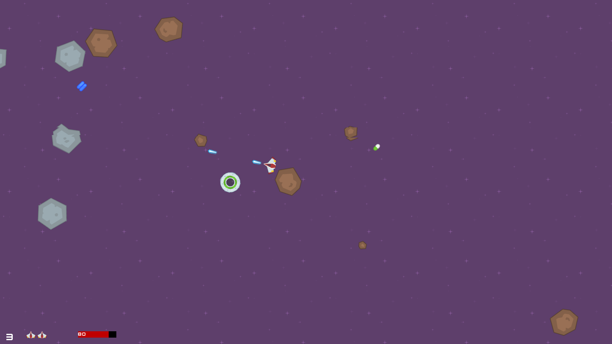

# Asteroids
Game of Asteroids made in Python using Pygame2



Assets by [Kenney](https://www.kenney.nl)
## Features
- Random asteroid spawn
- Alien shooting at player
- Asteroids and player teleport when out of boundary
- Basic sound manager over pygame.mixer to control every audio element
- GUI
- Basic text render class
- Sprites class hierarchy (StaticActor --> Actor --> Player/Alien)
- Powerups - health and shot upgrade

# Installation
```python
pip install -r requirements.txt
python -m asteroids.game
```